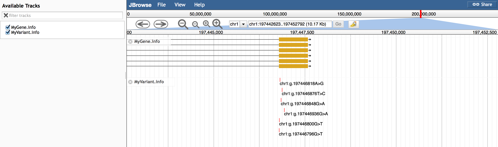

# myvariantviewer

A JBrowse plugin that fetches info from MyVariant.info and MyGene.info and displays them.

Example configuration to fetch genes and variants from hg19:

      {
         "storeClass" : "MyVariantViewer/Store/SeqFeature/Variants",
         "urlTemplate" : "http://myvariant.info/v1/query?q={refseq}:{start}-{end}",
         "type" : "CanvasFeatures",
         "label" : "MyVariant.info"
      },
      {
         "storeClass" : "MyVariantViewer/Store/SeqFeature/Genes",
         "urlTemplate" : "http://mygene.info/v2/query?q=hg19.{refseq}:{start}-{end}&fields=all",
         "subParts" : [
            "exon"
         ],
         "type" : "CanvasFeatures",
         "label" : "MyGene.info"
      }

Slightly more sophisticated query for specific attributes from MyVariant.info

    {
       "storeClass" : "MyVariantViewer/Store/SeqFeature/Variants",
       "urlTemplate" : "http://myvariant.info/v1/query?q={refseq}:{start}-{end}&fields=dbnsfp.exac",
       "type" : "CanvasFeatures",
       "label" : "MyVariant.info ExAC",
       "glyph": "MyVariantViewer/View/FeatureGlyph/ExAC"
    },
    {
       "storeClass" : "MyVariantViewer/Store/SeqFeature/Variants",
       "urlTemplate" : "http://myvariant.info/v1/query?q={refseq}:{start}-{end}&fields=dbnsfp.1000gp3",
       "type" : "CanvasFeatures",
       "label" : "MyVariant.info 1000 genomes",
       "glyph": "MyVariantViewer/View/FeatureGlyph/1000gp3"
    },
    {
       "storeClass" : "MyVariantViewer/Store/SeqFeature/Variants",
       "urlTemplate" : "http://myvariant.info/v1/query?q={refseq}:{start}-{end}&fields=dbsnp.alleles",
       "type" : "CanvasFeatures",
       "label" : "MyVariant.info dbSNP",
       "glyph": "MyVariantViewer/View/FeatureGlyph/dbSNP"
    }
