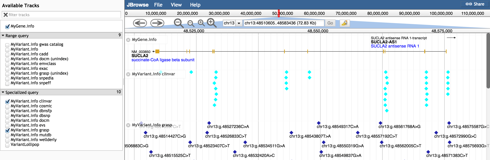

# myvariantviewer

A JBrowse plugin that fetches info from MyVariant.info and MyGene.info and displays them.

## Example configuration

Fetch genes and variants from hg19:

      {
         "storeClass" : "MyVariantViewer/Store/SeqFeature/Genes",
         "urlTemplate" : "http://mygene.info/v2/query?q=hg19.{refseq}:{start}-{end}&fields=all&email=colin.diesh@gmail.com&size=1000",
         "subParts" : [
            "exon"
         ],
         "type" : "CanvasFeatures",
         "label" : "MyGene.info",
         "hg19" : true
      },
      {
         "storeClass" : "MyVariantViewer/Store/SeqFeature/Variants",
         "urlTemplate" : "query?q={refseq}:{start}-{end}&size=1000&fetch_all=true&email=colin.diesh@gmail.com",
         "baseUrl": "http://myvariant.info/v1/",
         "type" : "CanvasFeatures",
         "label" : "MyVariant.info"
      }

Also note that a name store can be configured for querying myvariant.info via the search box as well

    "names": {
        "type": "MyVariantViewer/Store/Names/REST",
        "url": "http://myvariant.info/v1/query"
    }

## Only query from a specific data source

Example to only query variants from clinvar (combining the exists-in clinvar query with fields=clinvar return values)

      {
         "storeClass" : "MyVariantViewer/Store/SeqFeature/Variants",
         "baseUrl" : "http://myvariant.info/v1/",
         "urlTemplate" : "query?q={refseq}:{start}-{end} AND _exists_:clinvar&size=1000&fetch_all=true&email=colin.diesh@gmail.com&fields=clinvar",
         "type" : "CanvasFeatures",
         "label" : "MyVariant.info clinvar"
      }

See https://github.com/cmdcolin/myvariantviewer/blob/master/test/trackList.json for more

## Screenshots

Figure. Shows the grasp and clinvar specific data tracks from the test/trackList.json sample dataset.

# Demo

https://cmdcolin.github.io/jbrowse/

The test/trackList.json sample data directory can also be used as a reference
