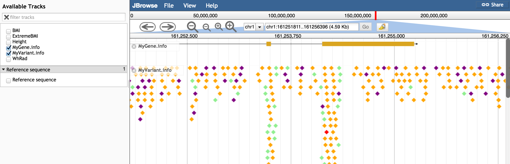

# myvariantviewer

A JBrowse plugin that fetches info from MyVariant.info and MyGene.info and displays them.

Example configuration to fetch genes and variants from hg19:

      {
         "storeClass" : "MyVariantViewer/Store/SeqFeature/Genes",
         "urlTemplate" : "http://mygene.info/v2/query?q=hg19.{refseq}:{start}-{end}&fields=all",
         "subParts" : [
            "exon"
         ],
         "type" : "CanvasFeatures",
         "label" : "MyGene.info"
      },
      {
         "storeClass" : "MyVariantViewer/Store/SeqFeature/Variants",
         "urlTemplate" : "query?q={refseq}:{start}-{end}&size=1000&fetch_all=true&email=colin.diesh@gmail.com",
         "baseUrl": "http://myvariant.info/v1/",
         "type" : "CanvasFeatures",
         "label" : "MyVariant.info",
      }

Note: we now use a "scroll query" so fetch_all should be supplied in the URL template

# Screenshots

